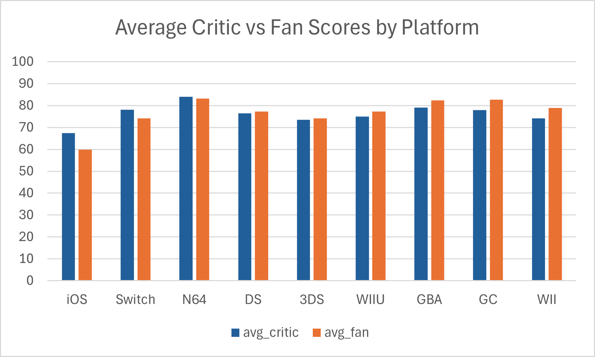
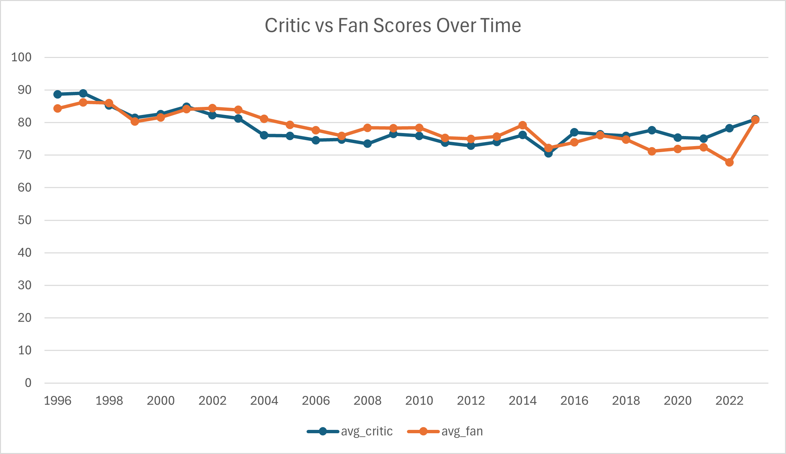

# Nintendo Games Analysis (Critics vs Fans)

**What**  

SQL + Excel project analyzing Nintendo game ratings from Metacritic.  

Compared critic scores vs fan scores across games, platforms, and years.

---

## How to Run

1. Open the dataset (`NintendoGames.csv`) in **DB Browser for SQLite**.

2. Import as table `nintendo_meta` (first row = headers).

3. Run queries from the `sql` folder to reproduce results.

4. Export results to CSV → build charts in Excel.

---

## Results

**Critic vs Fan by Platform**

**Critic vs Fan Over Time**

---

## Tools

- SQLite (DB Browser)

- Excel (for simple visuals)

---

## Notes

- Critic scores (`meta\_score`) are 0–100.  

- User scores (`user\_score`) are 0–10, scaled to 0–100 for comparison.

## Key Insights
- Pokémon titles (e.g., Scarlet, Violet, Sword/Shield) show the largest gaps, with critics rating them much higher than fans.  
- GameCube and Wii games are generally fan-favored compared to critics, highlighting nostalgia or underrated value.  
- Critic vs fan scores mostly trend together over time, but certain years show diverging sentiment.  
